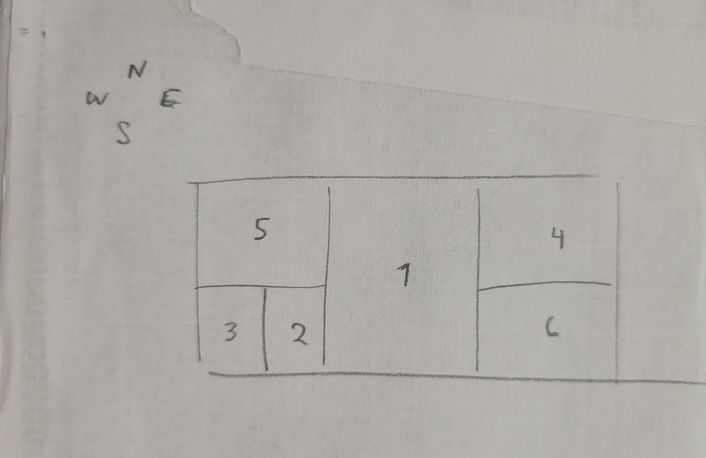

1. The Java Swing class enables information hiding, encapsulation, and inheritance. Ex. Buttons and text fields and labels are objects with their own attributes and methods (encapsulation) and they are components that inherit event handling functionality.
2. WindowAdapter implements WindowListener. Windowlistener lets you define functionality for window events, and WindowAdapter provides default implementation for WindowListener methods.  
3. 
4. 
```
public class ButtonClickListenerEx1 implements ActionListener {

    private JLabel label;
    private int count = 0;

    public ButtonClickListenerEx1(JLabel label) {
        this.label = label; //save the label to modify
    }


    public void actionPerformed(ActionEvent e) {
        if (label.getText().equals("Hello")) {
            label.setText("Goodbye"); //flip text back and forth
        }else{
            label.setText("Hello");
        }
        count++;
        JButton button = (JButton) e.getSource();
        button.setText("clicked " + count + " times");
    }
}
```
5. 
```
red.addActionListener(e -> label.setText("RED"));
blue.addActionListener(e -> label.setText("BLUE"));
```
6. Lambda expressions only work for a single method, but WindowListener has multiple methods.
7. s
